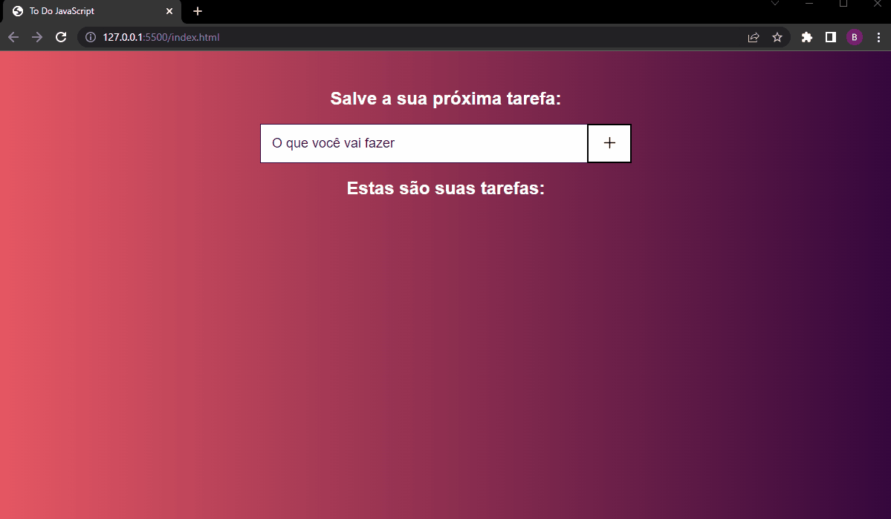

# Organizador de Tarefas

Aplicação muito prática para organizar as tarefas do dia e não deixar passar nada em branco!

#
Este projeto foi realizado com o intuito de práticar a manipulação do DOM em JavaScript, e faz parte de um processo pessoal de aprimoramento e melhoria continua na linguagem.

## Como Utilizar?

- Digite sua tarefa no local informado e click no botão " + " ou pressione a tecla "enter":

  

- Para finalizar a tarefa clique no botão com sinal de "check":

  
o estilo da tarefa será atualizado:

  

- Para excluir a tarefa clique no botão " x ":

Tecnologias Utilizadas:

 - HTML
 - CSS
 - JavaScript - ( Manipulação de DOM )

